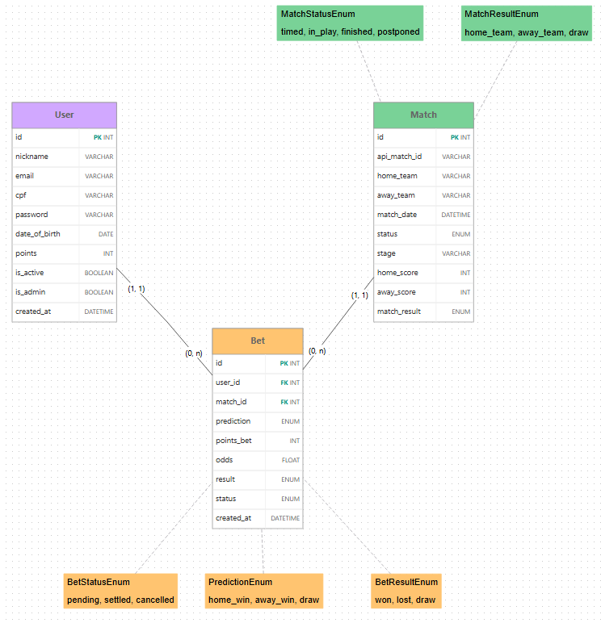
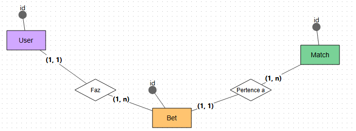

# World Cup Betting System (currently in development)

Sistema de apostas para a Copa do Mundo 2026 desenvolvido como projeto final do curso Futuro Digital.

> **Aviso:** Em desenvolvimento ativo. A estrutura, arquitetura e tecnologias utilizadas podem acabar sofrendo alterações durante o desenvolvimento.

## Status do Projeto

| Etapa | Descrição | Status |
|---|---|---|
| Fundação | Entidades, migrations, Docker, configurações | Concluído |
| Autenticação | Registro, login JWT, troca de senha | Concluído |
| Partidas | Importação via API externa, gestão admin | Concluído |
| Apostas | Criação, odds em tempo real, multiplicação | Em andamento |
| Liquidação | Processamento de resultados e pontos | Pendente |
| Exceções e docs | Handlers globais, docstrings, Swagger | Pendente |

## Arquitetura

### Diagrama Lógico


### Diagrama Conceitual


## Stack atual

* Python
* FastAPI
* Uvicorn
* SQLAlchemy
* Pydantic
* PostgreSQL
* Docker (infraestrutura do banco de dados)
* psycopg2
* Alembic
* JWT (jose)
* python-dotenv
* httpx


## Como rodar

```bash
docker compose up -d
uvicorn app.main:app --reload
```

Acesse a documentação em `http://localhost:8000/docs`


## Próximos Passos

- [X] Autenticação JWT e registro com validação de idade
- [ ] Integração com API football-data.org
- [ ] Sistema de apostas com odds em tempo real
- [ ] Liquidação automática de apostas ao finalizar partida
- [ ] Exceções personalizadas e handlers globais
