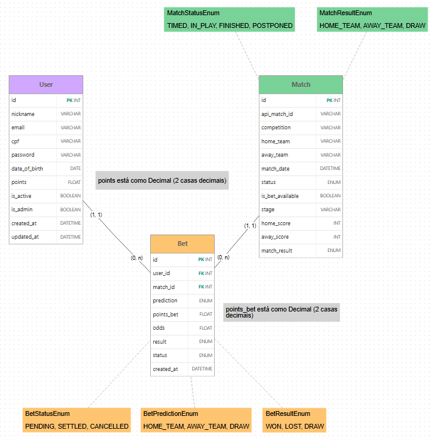
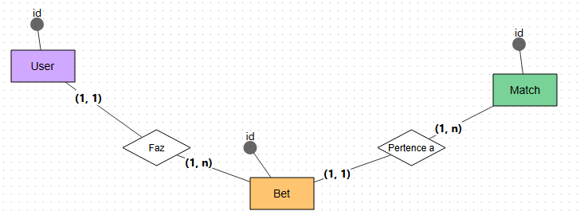

# World Cup Betting System (currently in development)

Sistema de apostas para a Copa do Mundo 2026 desenvolvido como projeto final do curso Futuro Digital.

> **Aviso:** Em desenvolvimento ativo. A estrutura, arquitetura e tecnologias utilizadas podem acabar sofrendo alterações durante o desenvolvimento.

## Status do Projeto

| Etapa | Descrição | Status |
|---|---|---|
| Fundação | Entidades, migrations, Docker, configurações | Concluído |
| Autenticação | Registro, login JWT, troca de senha | Concluído |
| Partidas | Importação via API externa, gestão admin | Concluído |
| Apostas | Criação, odds em tempo real, multiplicação | Concluído |
| Liquidação | Processamento de resultados e pontos | Testes |
| Exceções e docs | Handlers globais, docstrings, Swagger | Em andamento |

## Arquitetura

### Diagrama Lógico


### Diagrama Conceitual


## Stack atual

* Python
* FastAPI
* Uvicorn
* SQLAlchemy
* Pydantic
* PostgreSQL
* Docker (infraestrutura do banco de dados)
* psycopg2
* Alembic
* JWT (jose)
* python-dotenv
* httpx


## Como rodar

1. Crie e ative o ambiente virtual.

2. Instale as dependências:

```bash
pip install -r requirements.txt
```

3. Inicie o banco de dados (Postgres):

```bash
docker compose up -d
```

4. Execute a migration:

```bash
alembic upgrade head
```

> Execute este comando na primeira execução e sempre que houver novas migrations.

5. Inicie a aplicação:

```bash
uvicorn app.main:app --reload
```

6. Acesse a documentação da API via Swagger:

```
http://localhost:8000/docs
```


## Próximos Passos

- [X] Autenticação JWT e registro com validação de idade
- [X] Integração com API football-data.org
- [X] Sistema de apostas com odds em tempo real
- [X] Liquidação automática de apostas ao finalizar partida
- [X] Exceções personalizadas e handlers globais
